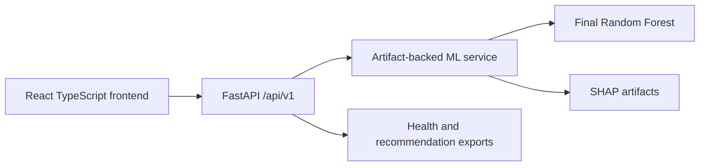

# Architecture

The browser owns presentation and navigation. FastAPI owns validation, artifact loading, prediction, score calculation, and API envelopes. ML artifacts are loaded once during application lifespan. No training is performed during requests. PostgreSQL can be introduced for prediction history and audit records without placing large ML matrices in the database.
